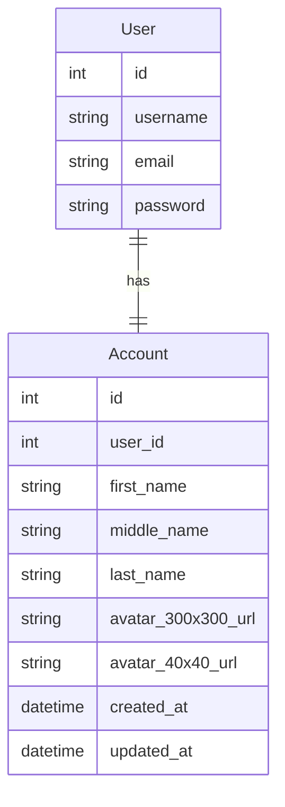
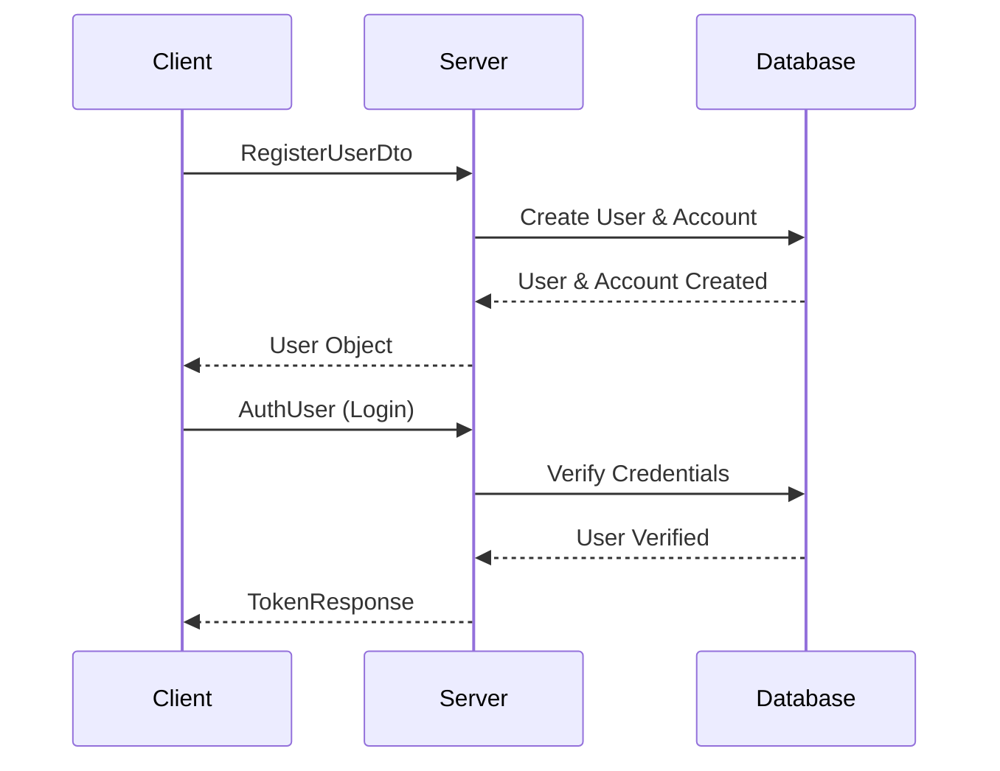

# Domain

--> domain/entities

# Rust Authentication Boilerplate Documentation

## Overview

This authentication boilerplate provides a robust foundation for user authentication, account management, and user operations in Rust. It implements clean architecture principles with clear separation of concerns through use cases.

## Core Features

- JWT-based authentication
- User registration and login
- User CRUD operations
- Account management
- Avatar upload with automatic WebP conversion
- Repository pattern implementation

## Authentication System

### Login Process

The login system uses JWT (JSON Web Tokens) for authentication with the following features:

```rust
// Example login usage
let login_use_case = LoginUseCase::new(auth_repository);
let token_response = login_use_case.execute(auth_user).await?;
```

Key characteristics:
- 24-hour token expiration
- Bearer token authentication
- JWT claims include user ID, expiration, and issued-at timestamps

### Registration

User registration is handled through a dedicated use case:

```rust
// Example registration
let register_use_case = RegisterUseCase::new(auth_repository);
let new_user = register_use_case.execute(register_dto).await?;
```

## User Management

### Available Operations

1. **Create User**
   ```rust
   let create_use_case = CreateUserUseCase::new(user_repository);
   let user = create_use_case.execute(user_dto).await?;
   ```

2. **Get User**
   ```rust
   let get_user_use_case = GetUserByIdUseCase::new(user_repository);
   let user = get_user_use_case.execute(user_id).await?;
   ```

3. **List Users**
   ```rust
   let list_users_use_case = ListUsersUseCase::new(user_repository);
   let users = list_users_use_case.execute().await?;
   ```

4. **Update User**
   ```rust
   let update_use_case = UpdateUserUseCase::new(user_repository);
   let updated_user = update_use_case.execute(id, user_dto).await?;
   ```

5. **Delete User**
   ```rust
   let delete_use_case = DeleteUserUseCase::new(user_repository);
   delete_use_case.execute(user_id).await?;
   ```

## Account Management

### Account Operations

1. **Get Account**
   ```rust
   let get_account_use_case = GetAccountUseCase::new(account_repository);
   let account = get_account_use_case.execute(user_id).await?;
   ```

2. **Update Account**
   ```rust
   let update_account_use_case = UpdateAccountUseCase::new(account_repository);
   let updated_account = update_account_use_case
       .execute(user_id, account_dto)
       .await?;
   ```

### Avatar Upload System

The avatar upload system includes automatic image processing:

- Converts uploads to WebP format
- Creates two sizes:
  - Large: 300x300 pixels
  - Small: 40x40 pixels
- Optimizes images with 80% quality

```rust
let upload_use_case = UploadAvatarUseCase::new(account_repository, upload_dir);
let response = upload_use_case.execute(user_id, image_data).await?;
```

Response includes URLs for both sizes:
```rust
{
    avatar_300x300_url: String,
    avatar_40x40_url: String,
    message: String
}
```

## Repository Pattern

The system implements the repository pattern with trait-based interfaces:

### Available Repositories

- `UserRepository`: Handles user CRUD operations
- `AuthRepository`: Manages authentication operations
- `AccountRepository`: Handles account-related operations

Each repository is implemented as a trait, allowing for different implementations (e.g., database, in-memory):

```rust
pub trait UserRepository {
    async fn find_by_id(&self, id: i32) -> Result<User, Box<dyn std::error::Error>>;
    async fn create(&self, user: CreateUserDto) -> Result<User, Box<dyn std::error::Error>>;
    async fn find_all(&self) -> Result<Vec<User>, Box<dyn std::error::Error>>;
    async fn update(&self, id: i32, user: UpdateUserDto) -> Result<User, Box<dyn std::error::Error>>;
    async fn delete(&self, id: i32) -> Result<(), Box<dyn std::error::Error>>;
}
```

## Error Handling

The system uses Rust's standard error handling with `Result` types and boxed errors:
- All operations return `Result<T, Box<dyn std::error::Error>>`
- Authentication operations use `Result<T, Box<dyn std::error::Error + Send + Sync>>`

## Environment Configuration

Required environment variables:
- `SECRET_KEY`: Used for JWT token signing

## Getting Started

1. Set up environment variables:
   ```bash
   export SECRET_KEY="your-secret-key"
   ```

2. Implement the required repositories for your storage backend

3. Initialize the use cases:
   ```rust
   let auth_repository = YourAuthRepository::new();
   let user_repository = YourUserRepository::new();
   let account_repository = YourAccountRepository::new();

   let login_use_case = LoginUseCase::new(auth_repository);
   let user_use_case = GetUserByIdUseCase::new(user_repository);
   let account_use_case = GetAccountUseCase::new(account_repository);
   ```

## Best Practices

1. Always implement proper error handling for all operations
2. Use strong typing for DTOs and entities
3. Keep repository implementations separate from use cases
4. Implement proper validation in DTOs
5. Use appropriate logging for operations (especially file operations)

## Security Considerations

1. JWT tokens expire after 24 hours
2. Passwords should be hashed in the repository implementation
3. File uploads are processed and converted to prevent malicious files
4. Environment variables are used for sensitive configuration


--> domain/repositories

## Domain Entities

### Account Entity

The Account entity represents user profile information and avatar details.

```rust
pub struct Account {
    pub id: i32,
    pub user_id: i32,
    pub first_name: Option<String>,
    pub middle_name: Option<String>,
    pub last_name: Option<String>,
    pub avatar_300x300_url: Option<String>,
    pub avatar_40x40_url: Option<String>,
    pub created_at: NaiveDateTime,
    pub updated_at: NaiveDateTime,
}
```

#### Related DTOs

1. **UpdateAccountDto**
   ```rust
   pub struct UpdateAccountDto {
       pub first_name: Option<String>,
       pub middle_name: Option<String>,
       pub last_name: Option<String>,
   }
   ```

2. **AvatarUploadResponse**
   ```rust
   pub struct AvatarUploadResponse {
       pub avatar_300x300_url: String,
       pub avatar_40x40_url: String,
       pub message: String,
   }
   ```

### Authentication Entities

#### AuthUser
Used for login authentication:
```rust
pub struct AuthUser {
    pub username: String,
    pub password: String,
}
```

#### JWT Claims
Represents JWT token claims:
```rust
pub struct Claims {
    pub sub: i32,  // user_id
    pub exp: i64,  // expiration time
    pub iat: i64,  // issued at
}
```

#### TokenResponse
Represents the authentication response:
```rust
pub struct TokenResponse {
    pub access_token: String,
    pub token_type: String,
    pub expires_in: i64,
}
```

#### RegisterUserDto
Used for user registration:
```rust
pub struct RegisterUserDto {
    pub username: String,
    pub email: String,
    pub password: String,
    pub first_name: Option<String>,
    pub middle_name: Option<String>,
    pub last_name: Option<String>,
}
```

### User Entity

The core User entity represents the authentication and identity aspects of a user:

```rust
pub struct User {
    pub id: i32,
    pub username: String,
    pub email: String,
    pub password: String,
}
```

#### User DTOs

1. **CreateUserDto**
   ```rust
   pub struct CreateUserDto {
       pub username: String,
       pub email: String,
       pub password: String,
   }
   ```

2. **UpdateUserDto**
   ```rust
   pub struct UpdateUserDto {
       pub username: String,
       pub email: String,
       pub password: String,
   }
   ```

## Entity Relationships



## Data Transfer Objects (DTOs)

### Authentication Flow DTOs



## Entity Features

### User Entity
- Primary authentication entity
- Stores core credentials
- Used for login and identity verification

### Account Entity
- Extends User with profile information
- Handles avatar management
- Tracks entity timestamps
- Supports partial updates via Optional fields

### Authentication DTOs
- Separates concerns between authentication and user data
- Provides specific structures for registration and login
- Implements JWT-based authentication flow

## Best Practices for Entity Usage

1. **Data Validation**
   - Implement validation for email format
   - Ensure password meets complexity requirements
   - Validate username uniqueness

2. **Security**
   - Never expose password field in serialized responses
   - Use password hashing in repository implementation
   - Implement rate limiting for authentication attempts

3. **Optional Fields**
   - Use `Option<String>` for non-required fields
   - Provide clear default values where appropriate
   - Handle None cases gracefully in the application logic

4. **DTO Conversions**
   - Implement From/Into traits for entity-DTO conversions
   - Validate data during conversions
   - Handle error cases explicitly

5. **Timestamps**
   - Use UTC for all timestamps
   - Update `updated_at` on all modifications
   - Preserve `created_at` throughout entity lifecycle

## Entity Extension Points

1. **User Entity**
   - Add role-based access control
   - Implement soft delete
   - Add verification status

2. **Account Entity**
   - Add additional profile fields
   - Implement social media links
   - Add privacy settings

3. **Authentication**
   - Add refresh token support
   - Implement multi-factor authentication
   - Add OAuth provider support

[Previous sections continue...]