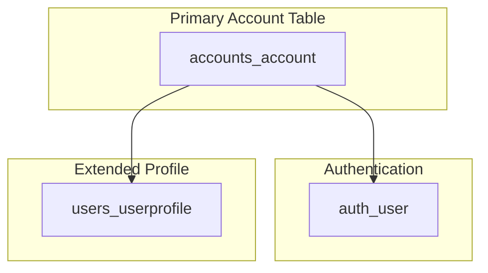

# Authentication

This document provides specific configurations for the Authentication Schema

## 📋 ER Diagram for Authentication

## 2. User Management System

### Account Management
The system implements a sophisticated user management structure with multiple layers of user data and authentication.

#### Account Types and Structure

#### accounts_account Fields
- **Identification**
  - School ID (Primary Identifier)
  - First Name
  - Middle Name
  - Last Name

- **Academic Information**
  - Course
  - Department
  - Major
  - Year Level

- **System Roles**
  - Position
  - Role
  - Access Level

- **Account Status**
  - is_activated
  - activation_date
  - last_login

- **Metrics**
  - profile_views
  - has_borrowed_book_transaction