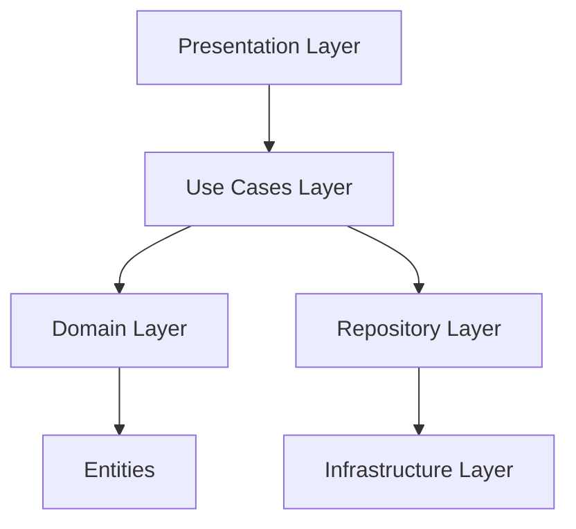
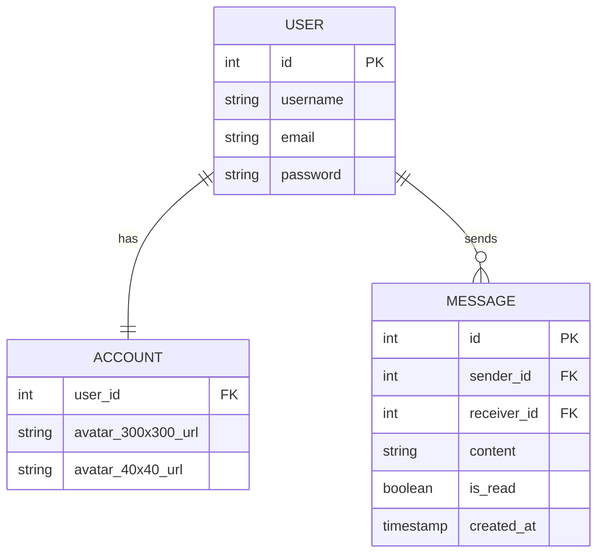

# Application

## Project Overview

This project follows a Clean Architecture pattern in Rust, separating concerns into distinct layers:
- Domain Layer
- Use Cases Layer
- Repository Layer
- Infrastructure Layer

### Architecture Diagram

## Use Cases

### Authentication Use Cases

#### Login Use Case
- **File**: `use_cases/auth_use_cases.rs`
- **Responsibility**: Handle user authentication and token generation
- **Key Methods**:
  - `execute(auth: AuthUser)`: Authenticates user and generates JWT token
  - Generates token with 24-hour expiration

#### Register Use Case
- **File**: `use_cases/auth_use_cases.rs`
- **Responsibility**: Handle new user registration
- **Key Methods**:
  - `execute(register_dto: RegisterUserDto)`: Creates a new user in the system

### User Management Use Cases

#### Get User By ID
- **File**: `use_cases/user_use_cases.rs`
- **Responsibility**: Retrieve a specific user by their ID
- **Key Methods**:
  - `execute(user_id: i32)`: Fetches user details

#### Create User
- **File**: `use_cases/user_use_cases.rs`
- **Responsibility**: Create a new user
- **Key Methods**:
  - `execute(user_dto: CreateUserDto)`: Creates a new user

#### Update User
- **File**: `use_cases/user_use_cases.rs`
- **Responsibility**: Update existing user information
- **Key Methods**:
  - `execute(id: i32, user_dto: UpdateUserDto)`: Updates user details

#### Delete User
- **File**: `use_cases/user_use_cases.rs`
- **Responsibility**: Remove a user from the system
- **Key Methods**:
  - `execute(user_id: i32)`: Deletes a user

### Account Management Use Cases

#### Get Account
- **File**: `use_cases/account_use_cases.rs`
- **Responsibility**: Retrieve account information
- **Key Methods**:
  - `execute(user_id: i32)`: Fetches account details

#### Update Account
- **File**: `use_cases/account_use_cases.rs`
- **Responsibility**: Update account information
- **Key Methods**:
  - `execute(user_id: i32, account_dto: UpdateAccountDto)`: Updates account details

#### Upload Avatar
- **File**: `use_cases/account_use_cases.rs`
- **Responsibility**: Handle avatar image uploads
- **Key Features**:
  - Converts image to WebP format
  - Creates two image sizes (300x300 and 40x40)
  - Generates unique filenames using UUID
  - Saves images to specified upload directory

### Messaging Use Cases

#### Send Message
- **File**: `use_cases/message_use_cases.rs`
- **Responsibility**: Send a message between users
- **Key Methods**:
  - `execute(sender_id: i32, receiver_id: i32, content: String)`: Creates and saves a new message

#### Get Messages
- **File**: `use_cases/message_use_cases.rs`
- **Responsibility**: Retrieve messages between two users
- **Key Methods**:
  - `execute(user1_id: i32, user2_id: i32)`: Fetches message history

## Entity Relationship Diagram (ERD)

## Dependencies

- `tokio`: Asynchronous runtime
- `image`: Image processing
- `uuid`: Unique identifier generation
- `webp`: WebP image encoding
- `jsonwebtoken`: JWT token generation
- `tracing`: Logging

## Configuration

### Environment Variables

- `SECRET_KEY`: Used for JWT token signing
- `UPLOAD_DIR`: Directory for avatar uploads

## Best Practices

1. Use generic repository traits for dependency injection
2. Separate concerns between layers
3. Use Result for error handling
4. Leverage Rust's type system for compile-time checks

## Error Handling

- Use `Box<dyn std::error::Error>` for flexible error propagation
- Implement custom error types for more specific error handling

## Performance Considerations

- Asynchronous operations with `tokio`
- Efficient image processing and conversion
- Minimal overhead with generics and traits