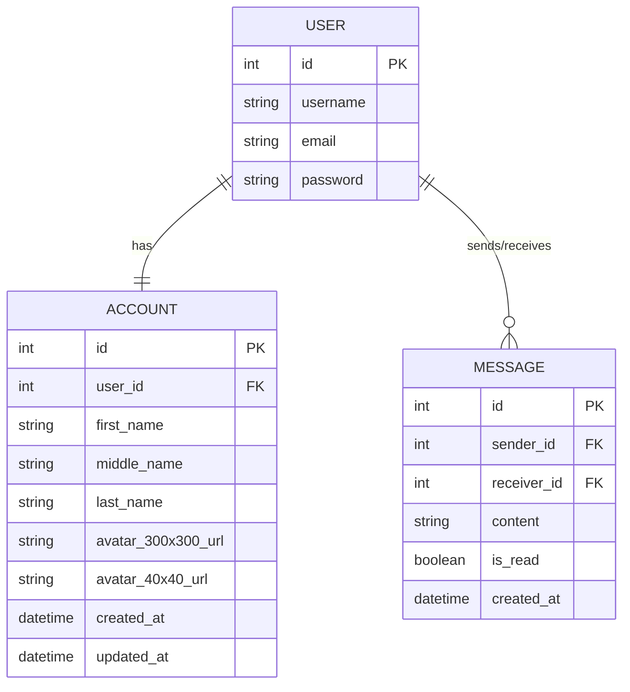

# Domain

## Project Overview
This is a Rust-based web application with a focus on user management, authentication, messaging, and account services.

## Entity Relationship Diagram

## Domain Entities

### User Entity
- Represents the core user information
- Attributes:
  - `id`: Unique identifier
  - `username`: User's login name
  - `email`: User's email address
  - `password`: Hashed user password

### Account Entity
- Extended user profile information
- Linked to User via `user_id`
- Optional fields for personal details
- Tracks avatar URLs and timestamps

### Message Entity
- Represents direct messages between users
- Tracks sender, receiver, content, and read status
- Supports WebSocket communication types

## Authentication Flow
1. User registers with `RegisterUserDto`
2. Credentials validated
3. JWT token generated with `Claims`
4. Token includes:
   - User ID (`sub`)
   - Issued at time (`iat`)
   - Expiration time (`exp`)

## Repository Interfaces
- Defines async operations for each domain entity
- Supports CRUD operations
- Uses Rust's `async_trait` for trait definitions

## WebSocket Message Types
- Chat messages
- Video call signaling
  - Call offers
  - Call answers
  - ICE candidates
- Error handling

## Key Design Patterns
- Domain-Driven Design
- Repository Pattern
- Async Rust with Actix
- JWT Authentication

## Technology Stack
- Language: Rust
- Web Framework: Actix
- ORM: Not specified (likely Diesel or SQLx)
- Serialization: Serde
- Authentication: JWT
- WebSocket: Actix actor system

## Recommendations
- Implement proper password hashing
- Add input validation
- Implement refresh token mechanism
- Add comprehensive error handling
- Consider rate limiting
- Implement proper logging

## Security Considerations
- Never store plain-text passwords
- Validate and sanitize all user inputs
- Use HTTPS for all communications
- Implement proper JWT token management
- Add multi-factor authentication