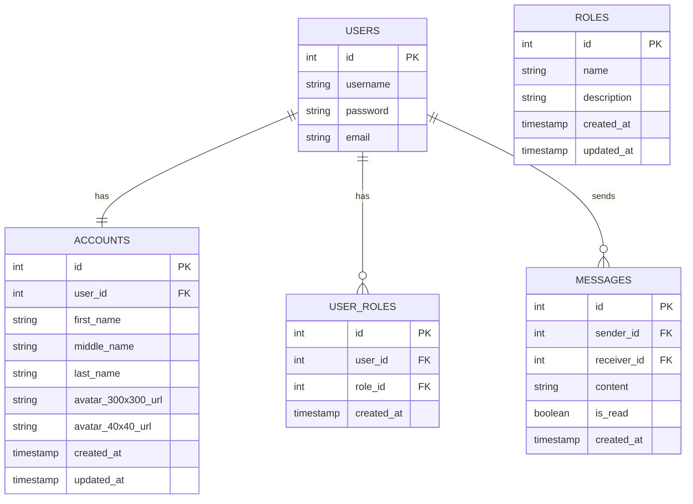

#  Main

## Project Overview
This is a Rust-based web application using Actix Web framework, implementing user authentication, account management, and real-time WebSocket communication.

## Database Schema (ERD Diagram)



## API Routes

### Authentication Routes (`/api/v1/auth`)
- `POST /login`: User login
  - Request Body: `{ username: string, password: string }`
  - Response: JWT token on successful authentication

- `POST /register`: User registration
  - Request Body: 
    ```json
    {
        "username": string,
        "password": string,
        "email": string
    }
    ```
  - Response: Created user details

### User Routes (`/api/v1/user`)
- `GET /`: List all users
- `GET /{id}`: Get user by ID
- `POST /`: Create a new user
  - Request Body: `CreateUserDto`
- `PUT /{id}`: Update user
  - Request Body: `UpdateUserDto`
- `DELETE /{id}`: Delete user

### Account Routes (`/api/v1/account`)
- `GET /{id}`: Get account details
- `PUT /{id}`: Update account details
  - Request Body: `UpdateAccountDto`
- `POST /{id}/avatar`: Upload user avatar
  - Multipart form data with 'avatar' file

## WebSocket Routes
- `GET /ws/{user_id}`: WebSocket connection endpoint

### WebSocket Message Types
- `Chat`: Send a message to another user
- `CallOffer`: Initiate a WebRTC call
- `CallAnswer`: Respond to a call
- `IceCandidate`: Exchange WebRTC connection details
- `EndCall`: Terminate an ongoing call

## Authentication
- Bearer token authentication is required for most routes
- Token is validated using JWT 

## Error Handling
- Comprehensive error responses with status codes and error messages
- WebSocket errors include detailed context

## Configuration
- Environment variables:
  - `SECRET_KEY`: Used for JWT token generation and validation
  - Database connection details
- Supports CORS for local development (localhost:3000)

## Key Features
- User registration and authentication
- Account management
- Real-time WebSocket communication
- Avatar upload
- Role-based access control (potential future enhancement)

## Technology Stack
- Rust
- Actix Web
- Diesel ORM
- PostgreSQL
- WebSocket (actix-web-actors)
- JWT for authentication

## Development Setup
1. Install Rust
2. Set up PostgreSQL
3. Configure `.env` file
4. Run database migrations
5. Start the server with `cargo run`